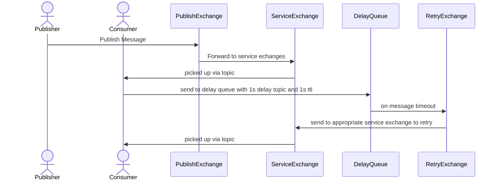

# Delayed retry of rabbitmq failed messages
This is a proof of concept implementation for handling delayed retrys of failed messages in rabbit mq.

It makes use of multiple exchanges/exchange bindings to re publish messages to a specific service should a message fail to properly consume after a set delay without publishing the message back to the whole cluster.

## Initial publish

